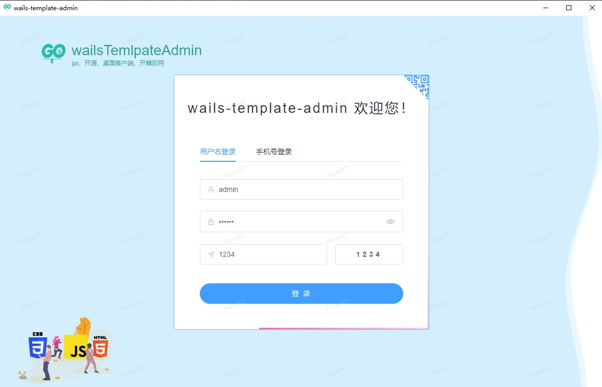
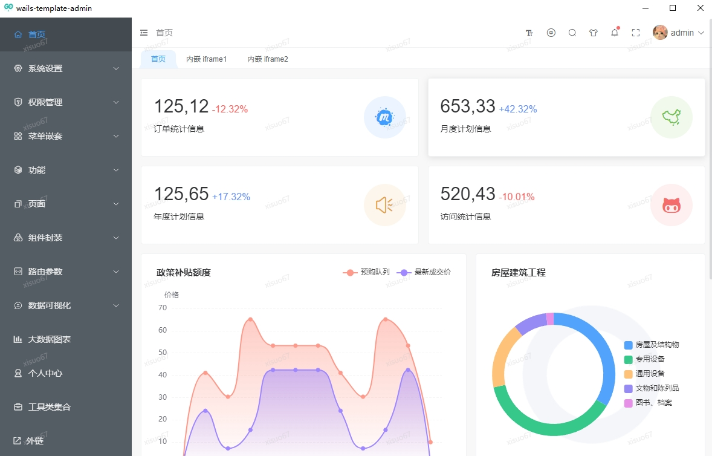

<p align="center">
  <a href="https://github.com/xisuo67/wails-template">
  </a>
</p>
<h1 align="center">wails-template</h1>

<div align="center">
    <p align="center">
    <a href="https://github.com/xisuo67/wails-template/stargazers" style="text-decoration:none" >
        
    </a>
    <a href="https://github.com/xisuo67/wails-template/network" style="text-decoration:none" >
        
    </a>
    <a href="https://github.com/xisuo67/wails-template/issues" style="text-decoration:none">
        
    </a>
    <a href="https://github.com/xisuo67/wails-template/blob/vue3-template/LICENSE.txt" style="text-decoration:none" >
        
    </a>
</p>
</div>


<table>
    <tr>
        <td></td>
        <td></td>
    </tr>

</table>

## 说明

> 这是一个基于wails的跨平台开箱即用的桌面客户端解决方案
>
> ps:由于下个项目，想做一个跨平台的桌面，又懒得到处找不熟悉的前端框架，正好github上看到wails，出于技术预研的目的，wails-template就诞生了
>
> 我将在未来一段时间内投入到这个项目的迭代中，并且持续输出一些关于这个项目的文档以及实用性较强的demo,以便未来产品迭，或帮助更多人

## 文档

> 时间不够，未来补充，假装这里有一个

## 如何运行

1、Build Environment

- Node.js [link](https://nodejs.org/en)
- pnpm ：`npm i -g pnpm`
- Go [link](https://go.dev/)
- Wails [link](https://wails.io/) ：`go install github.com/wailsapp/wails/v2/cmd/wails@latest`

2、Pull and Build

```bash
git clone https://github.com/xisuo67/wails-template.git

cd wails-template

wails build
```

